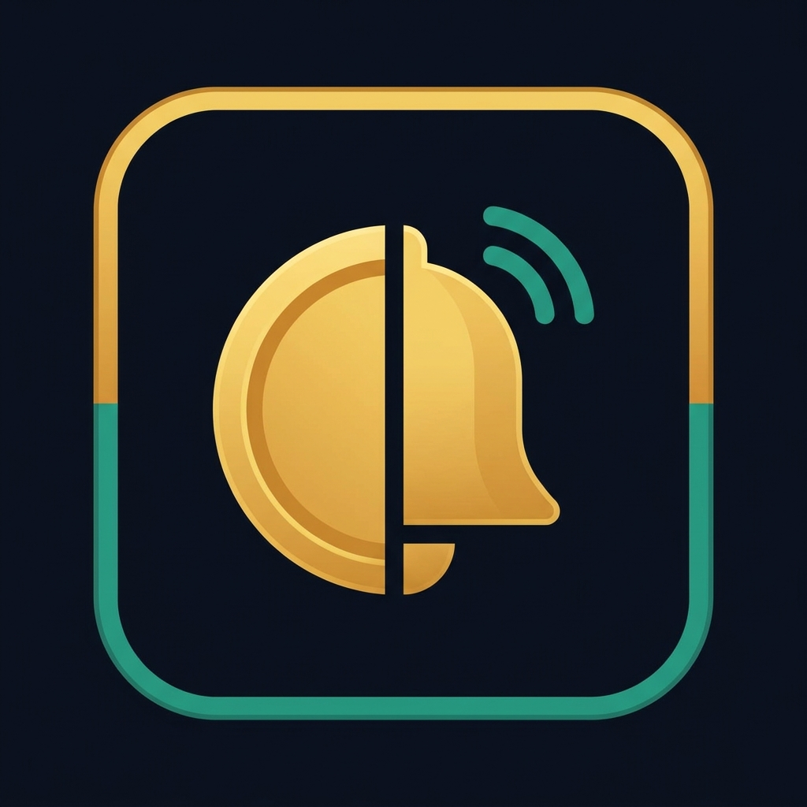
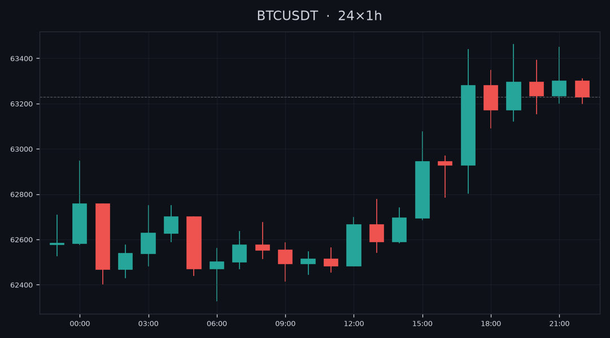

<p align="center">
  
</p>

<h1 align="center">CoinPing 🔔</h1>

A lightweight Telegram bot that watches cryptocurrency prices and pings you the
moment they cross a target you set. Built with async Python and the Binance
public API — no API key, no account, no cost.



> `/chart BTC` renders a live 24-hour candlestick chart, right inside the chat.

## Features

- **Live prices** — `/price BTC` returns the current Binance price for any pair
- **Candlestick charts** — `/chart BTC` sends a dark-themed 24h chart as an image
- **Price alarms** — `/alarm BTC > 70000` pings you when a level is crossed
- **Tap to delete** — alarms are listed with inline delete buttons
- **Bilingual** — auto-detects the client language, replies in Turkish or English
- **Per-user alarms** — each chat manages its own alarms, stored in SQLite
- **Automatic checks** — a background job polls prices every 30 seconds
- **Zero config** — bare tickers default to USDT pairs (`BTC` → `BTCUSDT`)

## Commands

| Command | Description |
|---|---|
| `/start`, `/help` | Show the welcome message |
| `/price BTC` | Current price of a symbol |
| `/chart BTC [15m\|1h\|4h\|1d]` | 24-candle chart image (default `1h`) |
| `/alarm BTC > 70000` | Alert when the price crosses above/below a level |
| `/alarms` | List your alarms with tap-to-delete buttons |
| `/delalarm <id>` | Delete an alarm by id |

## Setup

```bash
# 1. Install dependencies
python -m venv .venv
.venv\Scripts\activate        # Windows
# source .venv/bin/activate   # macOS/Linux
pip install -r requirements.txt

# 2. Configure your token
copy .env.example .env        # Windows  (cp on macOS/Linux)
# then edit .env and paste the token from @BotFather

# 3. Run
python bot.py
```

## Tech stack

- [python-telegram-bot](https://python-telegram-bot.org/) (async, with JobQueue)
- [httpx](https://www.python-httpx.org/) for async HTTP
- [matplotlib](https://matplotlib.org/) (headless) for candlestick charts
- SQLite (WAL mode) for alarm storage
- Binance public REST API for prices

## Project structure

```
coinping/
├── bot.py       # Handlers, background job, entry point
├── prices.py    # Binance price + kline fetching, symbol normalisation
├── chart.py     # Candlestick chart rendering (matplotlib)
├── db.py        # SQLite alarm storage
└── requirements.txt
```

## License

MIT
